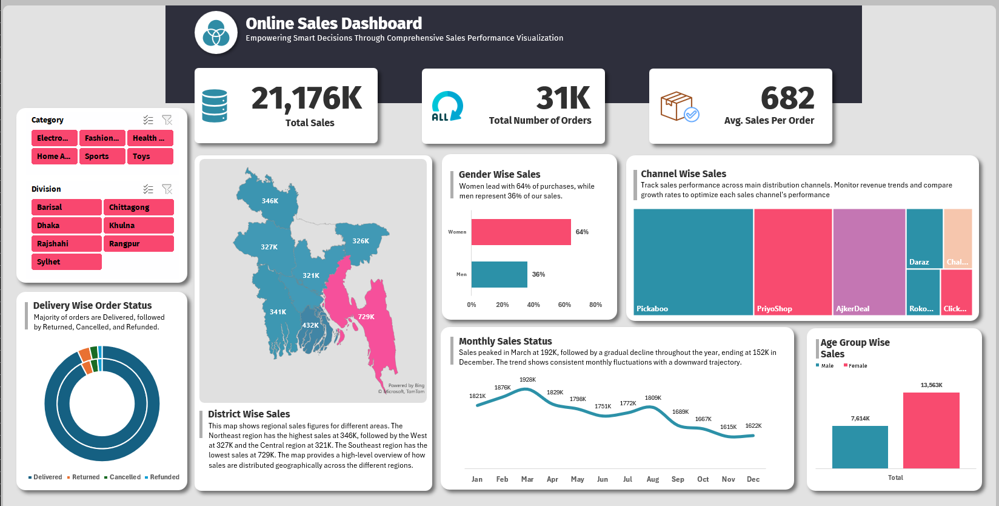

[Click here to watch the demo video](1107.mp4)

🚀 𝐏𝐫𝐨𝐣𝐞𝐜𝐭 𝐒𝐡𝐨𝐰𝐜𝐚𝐬𝐞: 𝐎𝐧𝐥𝐢𝐧𝐞 𝐒𝐚𝐥𝐞𝐬 𝐃𝐚𝐬𝐡𝐛𝐨𝐚𝐫𝐝 𝐢𝐧 𝐄𝐱𝐜𝐞𝐥 🚀

I’m excited to present my latest project—a comprehensive **Online Sales Dashboard** created in **Excel**! 🎉 This project allowed me to dive deep into sales data and transform complex numbers into insightful visualizations, empowering data-driven decisions for business growth.

🌟 𝐀𝐛𝐨𝐮𝐭 𝐭𝐡𝐞 𝐏𝐫𝐨𝐣𝐞𝐜𝐭:
The Online Sales Dashboard provides a high-level overview of a company’s sales metrics, helping stakeholders understand sales patterns and customer demographics at a glance. It includes data insights on various factors like total sales, order count, demographics, sales channels, and regional distribution.

📊 𝐊𝐞𝐲 𝐈𝐧𝐬𝐢𝐠𝐡𝐭𝐬:
- **Total Sales**: Achieved an impressive 21,176K in total sales.
- **Total Orders**: 31K orders, with an **Average Sales Per Order** of 682.
- **Gender-Wise Sales**: Women dominate with 64% of sales, indicating a major target demographic.
- **Top Sales Channels**: Major sales contributors include PriyoShop, AjkerDeal, and Daraz, providing insights into the effectiveness of each channel.
- **Regional Performance**: Southeast region leads with 729K sales, followed by 346K in the Northeast, enabling targeted marketing strategies.
- **Monthly Sales Trends**: Sales peaked in March at 192K and trended down to 152K by December, helping identify seasonal patterns.

🛠️ 𝐃𝐚𝐬𝐡𝐛𝐨𝐚𝐫𝐝 𝐅𝐞𝐚𝐭𝐮𝐫𝐞𝐬:
- **Interactive Filters**: Users can filter by **Category** and **Division** for deeper insights tailored to specific segments.
- **Visual Breakdown**: Includes donut charts, bar graphs, and line charts, making data easy to understand and actionable for stakeholders.
- **Geographical Sales Map**: Provides a visual breakdown of sales distribution across regions, helping identify high-potential areas.

🎓 𝐖𝐡𝐚𝐭 𝐈 𝐋𝐞𝐚𝐫𝐧𝐞𝐝:
Working on this project has been invaluable in enhancing my skills in:
- **Data Analysis**: Uncovering sales trends, segmenting data, and interpreting results for business impact.
- **Data Visualization**: Creating intuitive and visually appealing dashboards that communicate key insights effectively.
- **Excel Skills**: Mastering Excel’s powerful capabilities for data analysis and dashboard design.

🌍𝐍𝐞𝐱𝐭 𝐒𝐭𝐞𝐩𝐬:
As an aspiring Data Analyst passionate about transforming data into actionable insights, I’m actively looking for opportunities to apply my skills in a professional setting. This project marks a significant step in my data journey, and I’m excited to bring this experience into a real-world role.

If you're interested in data analytics, Excel, or dashboard design, let's connect! I’d love to discuss ideas, share knowledge, and explore new opportunities.

#DataAnalytics #ExcelDashboard #SalesAnalysis #DataVisualization #ExcelSkills #DashboardDesign #BusinessIntelligence #OpenToWork #StudentProjects #DataDriven #EntryLevelDataAnalyst
